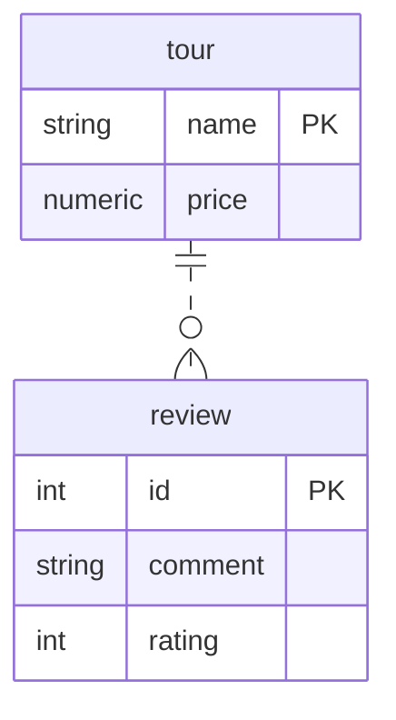

Материалы: связь [one to many](https://gitlab.com/golodnyuk.iv/db_2022/-/blob/main/%D0%9C%D0%B0%D1%82%D0%B5%D1%80%D0%B8%D0%B0%D0%BB%D1%8B%20%D0%BF%D0%BE%20%D0%BA%D1%83%D1%80%D1%81%D1%83/01.%20%D0%A1%D0%B2%D1%8F%D0%B7%D1%8C%20one%20to%20many.md)

## 1. Создать таблицы и задать связи между ними, соответствующие диаграмме:

У тура может быть несколько отзывов.\
Отзыв относится только к одному туру.

Связи между таблицами:\
`tour <- review`: [one to many](https://gitlab.com/golodnyuk.iv/db_2022/-/blob/main/%D0%9C%D0%B0%D1%82%D0%B5%D1%80%D0%B8%D0%B0%D0%BB%D1%8B%20%D0%BF%D0%BE%20%D0%BA%D1%83%D1%80%D1%81%D1%83/01.%20%D0%A1%D0%B2%D1%8F%D0%B7%D1%8C%20one%20to%20many.md), review ссылается на tour

## 2. Добавить 2 тура. Каждому туру добавить по 2 отзыва

## 3. Вывести все туры и их отзывы (за один запрос)