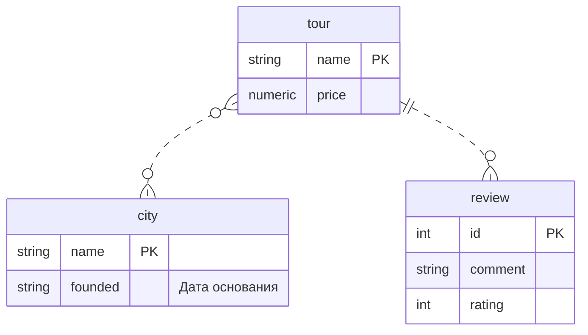

Материалы: связь [one to many](https://gitlab.com/golodnyuk.iv/db_2022/-/blob/main/%D0%9C%D0%B0%D1%82%D0%B5%D1%80%D0%B8%D0%B0%D0%BB%D1%8B%20%D0%BF%D0%BE%20%D0%BA%D1%83%D1%80%D1%81%D1%83/01.%20%D0%A1%D0%B2%D1%8F%D0%B7%D1%8C%20one%20to%20many.md), связь [many to many](https://gitlab.com/golodnyuk.iv/db_2022/-/blob/main/%D0%9C%D0%B0%D1%82%D0%B5%D1%80%D0%B8%D0%B0%D0%BB%D1%8B%20%D0%BF%D0%BE%20%D0%BA%D1%83%D1%80%D1%81%D1%83/03.%20%D0%A1%D0%B2%D1%8F%D0%B7%D1%8C%20many%20to%20many.md)

## 1. Создать таблицы и задать связи между ними, соответствующие диаграмме:



Тур может проходить через несколько городов.\
Через город может проходить несколько туров.

У тура может быть несколько отзывов.\
Отзыв относится только к одному туру.

Связи между таблицами:\
`tour <-> city`: [many to many](https://gitlab.com/golodnyuk.iv/db_2022/-/blob/main/%D0%9C%D0%B0%D1%82%D0%B5%D1%80%D0%B8%D0%B0%D0%BB%D1%8B%20%D0%BF%D0%BE%20%D0%BA%D1%83%D1%80%D1%81%D1%83/01.%20%D0%A1%D0%B2%D1%8F%D0%B7%D1%8C%20one%20to%20many.md) \
`tour <- review`: [one to many](https://gitlab.com/golodnyuk.iv/db_2022/-/blob/main/%D0%9C%D0%B0%D1%82%D0%B5%D1%80%D0%B8%D0%B0%D0%BB%D1%8B%20%D0%BF%D0%BE%20%D0%BA%D1%83%D1%80%D1%81%D1%83/01.%20%D0%A1%D0%B2%D1%8F%D0%B7%D1%8C%20one%20to%20many.md), review ссылается на tour

## 2. Заполнить таблицы данными:
Тур "В гостях у хаски", города: [Приозерск(1295), Сортавала(1468)];\
Тур "Хиты карелии", города: [Сортавала, Валаам(1407)], отзывы: [("Отличный тур!", 5), ("Не понравилось.", 2)]

## 3. Вывести все туры с их городами и отзывами (за один запрос)
*Примечание:* т.к. столбец `name` у таблиц повторяются, в селекте нужно явно указывать к какой таблице они относятся. Например:
```sql
select *
from tour
         join city_to_tour on tour.name = city_to_tour.tour_name
         join city on city.name = city_to_tour.city_name;
```
*Подсказка:* нужно использовать `left join`