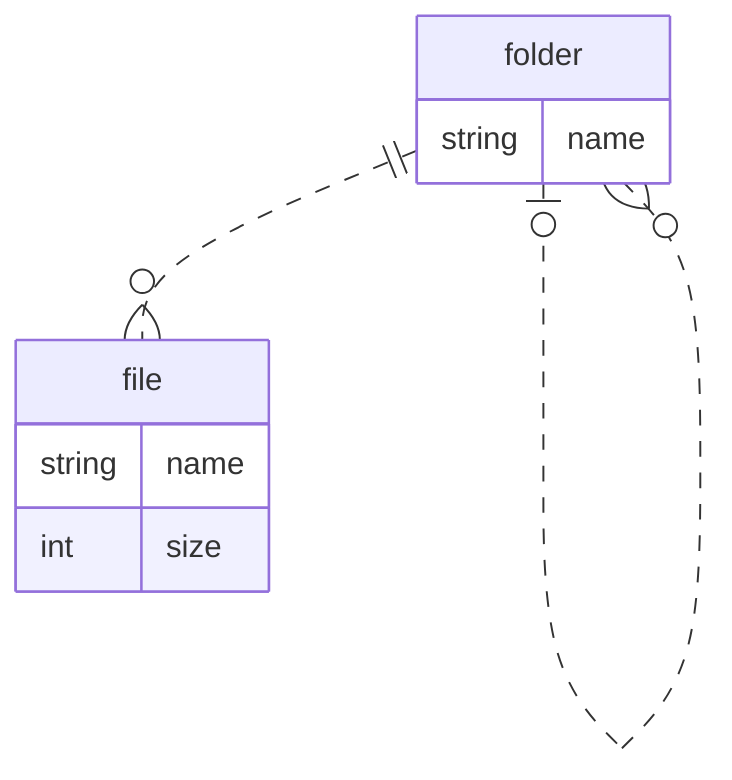

Материалы: [хранение иерархических структур данных](https://gitlab.com/golodnyuk.iv/db_2022/-/blob/main/%D0%9C%D0%B0%D1%82%D0%B5%D1%80%D0%B8%D0%B0%D0%BB%D1%8B%20%D0%BF%D0%BE%20%D0%BA%D1%83%D1%80%D1%81%D1%83/10.%20%D0%A5%D1%80%D0%B0%D0%BD%D0%B5%D0%BD%D0%B8%D0%B5%20%D0%B8%D0%B5%D1%80%D0%B0%D1%80%D1%85%D0%B8%D1%87%D0%B5%D1%81%D0%BA%D0%B8%D1%85%20%D1%81%D1%82%D1%80%D1%83%D0%BA%D1%82%D1%83%D1%80%20%D0%B4%D0%B0%D0%BD%D0%BD%D1%8B%D1%85.md)

## 1. Создать таблицы и задать связи между ними, соответствующие диаграмме:



В папке может быть много других файлов и папок.\
У папки может быть одна родительская папка.

У файла должна быть одна родительская папка.

У каждой сущности должен быть [автогенерируемый первичный ключ id](https://gitlab.com/golodnyuk.iv/db_2022/-/blob/main/%D0%9C%D0%B0%D1%82%D0%B5%D1%80%D0%B8%D0%B0%D0%BB%D1%8B%20%D0%BF%D0%BE%20%D0%BA%D1%83%D1%80%D1%81%D1%83/05.%20%D0%90%D0%B2%D1%82%D0%BE%D0%BC%D0%B0%D1%82%D0%B8%D1%87%D0%B5%D1%81%D0%BA%D0%B0%D1%8F%20%D0%B3%D0%B5%D0%BD%D0%B5%D1%80%D0%B0%D1%86%D0%B8%D1%8F%20id.md).

## 2. Заполнить таблицы данными:
Добавить одну корневую папку с двумя дочерними. Дочерним папкам добавить по одной дочерней папке. Добавить 4 файла в разные папки.\
*Всего должно получиться 5 папок и 4 файла*

## 3. Вывести все папки со вложенными папками и файлами (за один запрос)
*Примечание:* при соединении таблиц с одинаковым названием нужно добавлять псевдонимы. Например:
```sql
select *
from folder as parent
         join folder as child
              on parent.id = child.parent_id;
```
*Подсказка:* нужно использовать `left join`

## 4*. Добавить ограничения уникальности для названий файлов и папок в пределах одной папки
*Примечание 1:* среди всех названий без привязки к конкретной папке названия могут повторятся.\
*Примечание 2:* название файла и название папки в одной папке может совпадать.
