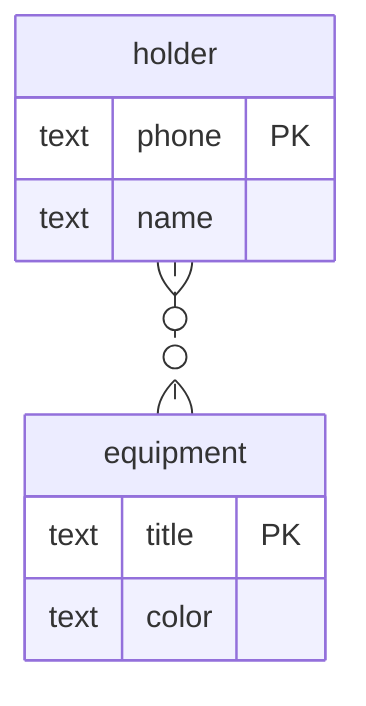

Даны 2 сущности:
- владелец со свойствами имя и телефон
- экипировка со свойствами название и цвет

Владелец может отвечать за множество разной экипировки.\
Экипировка может быть распределена между несколькими владельцами.

Данным сущностям соответствует следующая диаграмма:


Этой диаграмме в SQL соответствуют следующие таблицы и связи:
```sql
drop table if exists equipment cascade;
drop table if exists holder cascade;
drop table if exists equipment_to_holder cascade;


-- главная таблица
create table holder
(
    name  text,
    phone text
);

alter table holder
    add primary key (phone);

-- главная таблица
create table equipment
(
    title text,
    color text
);

alter table equipment
    add primary key (title);

-- промежуточная таблица через которую будут связываться строки из главных таблиц
create table equipment_to_holder
(
    equipment_title text,
    holder_phone    text
);

-- для промежуточной таблицы задаются 2 внешних ключа, указывающих на главные таблицы
alter table equipment_to_holder
    add foreign key (equipment_title) references equipment (title);

alter table equipment_to_holder
    add foreign key (holder_phone) references holder (phone);

-- дополнительно накладывается ограничения на уникальность комбинаций внешних ключей
alter table equipment_to_holder
    add unique (equipment_title, holder_phone);

-- и not null для значений внешних ключей
alter table equipment_to_holder
    alter column equipment_title set not null;

alter table equipment_to_holder
    alter column holder_phone set not null;

/*
-- альтернативный способ: вместо задания уникальности комбинации внешних ключей и ограничения на not null
-- можно задать первичный ключ на столбцы с внешними ключами, в таком случае будет автоматическая проверка
-- на уникальность комбинаций и not null

alter table equipment_to_holder
    add primary key (equipment_title, holder_phone);
*/

insert into equipment (title, color)
values ('Ракетка', 'Красный'),
       ('Мангал', 'Красный'),
       ('Мяч', 'Белый'),
       ('Палатка', 'Серый'),
       ('Удочка', 'Чёрный'),
       ('Спальник', 'Синий'),
       ('Рюкзак', 'Зелёный'),
       ('Дождевик', 'Серый'),
       ('Компас', 'Красный'),
       ('Термос', 'Чёрный');

insert into holder (name, phone)
values ('Альберт Андреевич', '0001'),
       ('Иван Вячеславович', '0002'),
       ('Вячеслав Александрович', '0003');

insert into equipment_to_holder (equipment_title, holder_phone)
values ('Мяч', '0001'),
       ('Рюкзак', '0001'),
       ('Мангал', '0001'),
       ('Ракетка', '0001'),
       ('Дождевик', '0001'),
       ('Удочка', '0002'),
       ('Спальник', '0002'),
       ('Ракетка', '0002'),
       ('Палатка', '0002'),
       ('Компас', '0002'),
       ('Мяч', '0003'),
       ('Ракетка', '0003'),
       ('Термос', '0003'),
       ('Палатка', '0003');

-- соединение таблиц
select name, holder_phone, equipment_title, color
from holder
         join equipment_to_holder on phone = holder_phone
         join equipment on equipment_title = title;
```

На языке Python данным сущностям соответствуют следующие классы:
```python
class Holder:
    name: str
    phone: str
    equipment: List[Equipment]

class Equipment:
    title: str
    color: str
    holder: List[Holder]
```