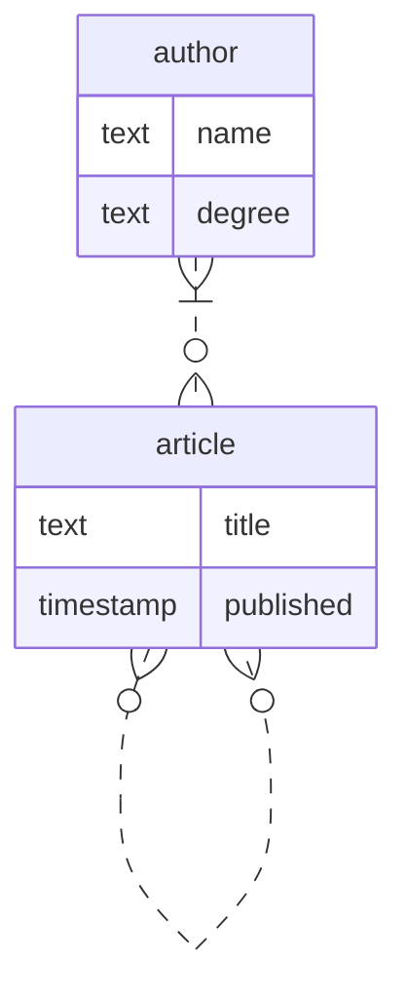

Даны 2 сущности:
- статья со свойствами название и дата публикации
- автор со свойствами имя и научная степень

Статья может ссылаться на другие статьи.\
У статьи есть один или несколько авторов. У автора может быть несколько статей.

Данным сущностям соответствует следующая диаграмма:


Этой диаграмме в SQL соответствуют следующие таблицы и связи:
```sql
drop table if exists article cascade;
drop table if exists author cascade;
drop table if exists article_to_article cascade;
drop table if exists article_to_author cascade;

create table article
(
    id        int generated always as identity primary key,
    title     text,
    published date
);

create table author
(
    id     int generated always as identity primary key,
    name   text,
    degree text
);

create table article_to_article
(
    referenced_from_id int references article not null,
    referenced_to_id   int references article not null,
    unique (referenced_from_id, referenced_to_id)
);

create table article_to_author
(
    article_id int references article not null,
    author_id  int references author  not null,
    unique (article_id, author_id)
);
```

### Заполнение таблиц данными:

Авторы:
- Альберт Андреевич, магистр
- Иван Вячеславович, магистр
- Вячеслав Александрович, кандидат


Статьи:
- Развитие логических моделей данных, В.А.
- Научные вызовы технологиям СУБД [В.А., А.А.] -> Развитие логических моделей данных
- Эволюция систем, насыщенных данными, И.В.
- Патологии больших данных, И.В. -> [Научные вызовы технологиям СУБД, Эволюция систем, насыщенных данными, Развитие логических моделей данных]
- Транзакционная память А.А., В.А.
- OLTP в Зазеркалье, В.А -> [Транзакционная память, Патологии больших данных]


```sql
insert into article (title, published)
values ('Развитие логических моделей данных', '2015-01-01'),
       ('Научные вызовы технологиям СУБД', '2016-01-01'),
       ('Эволюция систем, насыщенных данными', '2017-01-01'),
       ('Патологии больших данных', '2018-01-01'),
       ('Транзакционная память', '2019-01-01'),
       ('OLTP в Зазеркалье', '2020-01-01');

insert into author (name, degree)
values ('Альберт Андреевич', 'магистр'),
       ('Иван Вячеславович', 'магистр'),
       ('Вячеслав Александрович', 'кандидат');

insert into article_to_article
values (2, 1),
       (4, 2),
       (4, 3),
       (4, 1),
       (6, 5),
       (6, 4);

insert into article_to_author
values (1, 3),
       (2, 3),
       (2, 1),
       (3, 2),
       (4, 2),
       (5, 1),
       (5, 3),
       (6, 3);
```

Пример вывода статей с их авторами и их ссылками на другие статьи:
```sql
select article.id, article.title, author.name as author_name, ref_to_article.title as referenced_article_name
from article
         join article_to_author on article.id = article_to_author.article_id
         join author on article_to_author.author_id = author.id
         left join article_to_article on article.id = article_to_article.referenced_from_id
         left join article as ref_to_article on referenced_to_id = ref_to_article.id;
```
