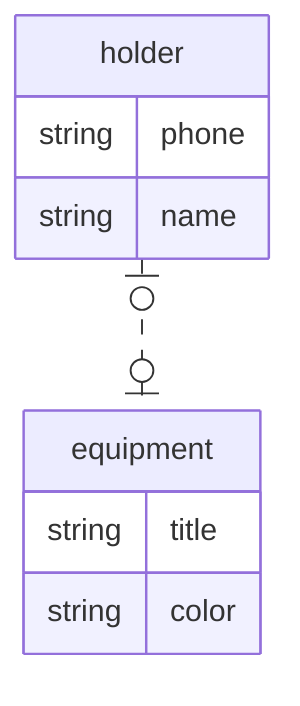
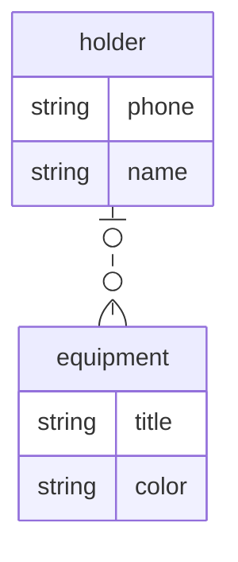

В MongoDB существует множество подходов к хранению данных, в данных примерах рассмотрены
одни из вариантов, наиболее близких к тем, что используются в реляционных базах данных.

# Хранение сущностей со связью один к одному:

Даны 2 сущности:
- владелец со свойствами имя и телефон
- экипировка со свойствами название и цвет

Владелец может отвечать только за одно наименование экипировки.\
У экипировки может быть только один владелец.

Данным сущностям соответствует следующая диаграмма:


Этой диаграмме в MongoDB соответствует следующая коллекция:
```js
// аналог drop table if exists
db.holders.drop()

// определение схемы (не обязательный шаг)
db.createCollection("holders", {
    validator: {
        $jsonSchema: {
            bsonType: "object",
            properties: {
                _id: {
                    bsonType: "objectId"
                },
                name: {
                    bsonType: "string"
                },
                phone: {
                    bsonType: "string"
                },
                equipment: {
                    bsonType: "object",
                    properties: {
                        title: {
                            bsonType: "string"
                        },
                        color: {
                            bsonType: "string"
                        }
                    },
                    required: ["title", "color"], // аналог not null
                    additionalProperties: false // запрет на дополнительные поля, например чтобы нельзя было
                    // вставить объект { title: "Термос", color: "Чёрный", phone: "8-800-000-00-00" }
                }
            },
            required: ["phone", "name"],
            additionalProperties: false
        }
    }
})

db.holders.insertMany([
    {
        name: "Альберт Андреевич",
        phone: "0001",
        equipment: { title: "Термос", color: "Чёрный" }
    },
    {
        name: "Иван Вячеславович",
        phone: "0002",
        equipment: { title: "Ракетка", color: "Серый" }
    },
    {
        name: "Вячеслав Александрович",
        phone: "0003",
        equipment: { title: "Мангал", color: "Красный" }
    },
    {
        name: "Алексей Андреевич",
        phone: "0004"
    }
])

// аналог select * from holders
db.holders.find()
```

# Хранение сущностей со связью один ко многим:

Даны 2 сущности:
- владелец со свойствами имя и телефон
- экипировка со свойствами название и цвет

Владелец может отвечать за множество разной экипировки.\
У экипировки может быть только один владелец.

Данным сущностям соответствует следующая диаграмма:


Этой диаграмме в MongoDB соответствует следующая коллекция:
```js
db.holders.drop()

db.createCollection("holders", {
    validator: {
        $jsonSchema: {
            bsonType: "object",
            properties: {
                _id: {
                    bsonType: "objectId"
                },
                name: {
                    bsonType: "string"
                },
                phone: {
                    bsonType: "string"
                },
                equipment: {
                    bsonType: "array",
                    items: {
                        bsonType: "object",
                        properties: {
                            title: {
                                bsonType: "string"
                            },
                            color: {
                                bsonType: "string"
                            }
                        },
                        required: ["title", "color"],
                        additionalProperties: false
                    }
                }
            },
            required: ["phone", "name"],
            additionalProperties: false
        }
    }
})

db.holders.insertMany([
    {
        name: "Альберт Андреевич",
        phone: "0001",
        equipment: [
            { title: "Термос", color: "Чёрный" },
            { title: "Мяч", color: "Белый" },
            { title: "Удочка", color: "Чёрный" },
            { title: "Спальник", color: "Синий" }
        ]
    },
    {
        name: "Иван Вячеславович",
        phone: "0002",
        equipment: [
            { title: "Ракетка", color: "Серый" },
            { title: "Палатка", color: "Красный" },
            { title: "Компас", color: "Красный" }
        ]
    },
    {
        name: "Вячеслав Александрович",
        phone: "0003",
        equipment: [
            { title: "Мангал", color: "Красный" },
            { title: "Рюкзак", color: "Зелёный" },
            { title: "Дождевик", color: "Серый" }
        ]
    },
    {
        name: "Алексей Андреевич",
        phone: "0004"
    }
])

db.holders.find()
```

# Хранение сущностей со связью многие ко многим:

Даны 2 сущности:
- владелец со свойствами имя и телефон
- экипировка со свойствами название и цвет

Владелец может отвечать за множество разной экипировки.\
Экипировка может быть распределена между несколькими владельцами.

Данным сущностям соответствует следующая диаграмма:


Этой диаграмме в MongoDB соответствуют следующие коллекции:
```js
db.holders.drop()
db.equipment.drop()

db.createCollection("equipment", {
    validator: {
        $jsonSchema: {
            bsonType: "object",
            properties: {
                _id: {
                    bsonType: "objectId"
                },
                title: {
                    bsonType: "string"
                },
                color: {
                    bsonType: "string"
                }
            },
            required: ["title", "color"],
            additionalProperties: false
        }
    }
})

db.equipment.insertMany([
    { title: "Термос", color: "Чёрный" },
    { title: "Мяч", color: "Белый" },
    { title: "Удочка", color: "Чёрный" },
    { title: "Спальник", color: "Синий" },
    { title: "Ракетка", color: "Серый" },
    { title: "Палатка", color: "Красный" },
    { title: "Компас", color: "Красный" },
    { title: "Мангал", color: "Красный" },
    { title: "Рюкзак", color: "Зелёный" },
    { title: "Дождевик", color: "Серый" }
])

db.createCollection("holders", {
    validator: {
        $jsonSchema: {
            bsonType: "object",
            properties: {
                _id: {
                    bsonType: "objectId"
                },
                name: {
                    bsonType: "string"
                },
                phone: {
                    bsonType: "string"
                },
                equipmentTitles: {
                    bsonType: "array",
                    uniqueItems: true,
                    items: {
                        bsonType: "string"
                    }
                }
            },
            required: ["phone", "name"],
            additionalProperties: false
        }
    }
})

db.holders.insertMany([
    {
        name: "Альберт Андреевич",
        phone: "0001",
        equipmentTitles: ["Мяч", "Рюкзак", "Мангал", "Ракетка", "Дождевик"]
    },
    {
        name: "Иван Вячеславович",
        phone: "0002",
        equipmentTitles: ["Удочка", "Спальник", "Ракетка", "Палатка", "Компас"]
    },
    {
        name: "Вячеслав Александрович",
        phone: "0003",
        equipmentTitles: ["Мяч", "Ракетка", "Термос", "Палатка"]
    },
    {
        name: "Алексей Андреевич",
        phone: "0004"
    }
])

// аналог join
db.holders.aggregate([
    {
        $lookup: {
            from: "equipment",
            localField: "equipmentTitles",
            foreignField: "title",
            as: "joinedEquipment"
        }
    }
])
```

