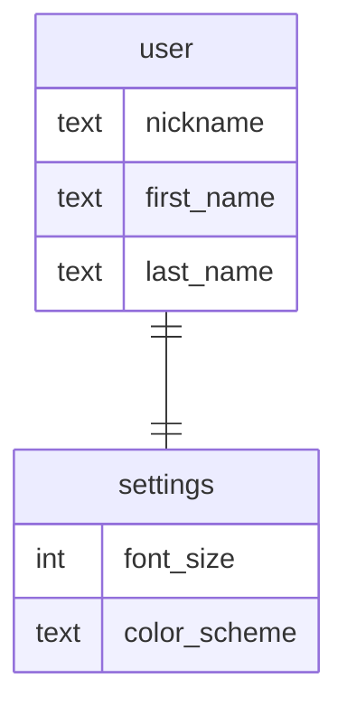

Материалы: связь [one to one](https://gitlab.com/golodnyuk.iv/db_2022/-/blob/main/%D0%9C%D0%B0%D1%82%D0%B5%D1%80%D0%B8%D0%B0%D0%BB%D1%8B%20%D0%BF%D0%BE%20%D0%BA%D1%83%D1%80%D1%81%D1%83/02.%20%D0%A1%D0%B2%D1%8F%D0%B7%D1%8C%20one%20to%20one.md)

## 1. Создать таблицы и задать связи между ними, соответствующие диаграмме:

У каждого пользователя есть свои личные настройки.

Связи между таблицами:\
`user <- settings`: [one to one](https://gitlab.com/golodnyuk.iv/db_2022/-/blob/main/%D0%9C%D0%B0%D1%82%D0%B5%D1%80%D0%B8%D0%B0%D0%BB%D1%8B%20%D0%BF%D0%BE%20%D0%BA%D1%83%D1%80%D1%81%D1%83/02.%20%D0%A1%D0%B2%D1%8F%D0%B7%D1%8C%20one%20to%20one.md), settings ссылается на user

## 2. Добавить 2 юзера. Каждому юзеру добавить настройки

## 3. Вывести всех юзеров вместе с их настройками (за один запрос)