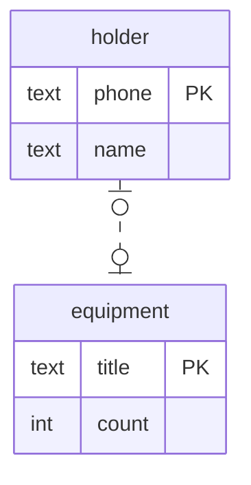

Даны 2 сущности:
- владелец со свойствами имя и телефон
- экипировка со свойствами название и количество

Владелец может отвечать только за одно наименование экипировки.\
У экипировки может быть только один владелец.

Данным сущностям соответствует следующая диаграмма:


Этой диаграмме в SQL соответствуют следующие таблицы и связи:
```sql
drop table if exists equipment cascade;
drop table if exists holder cascade;

-- главная таблица
create table holder
(
    name  text,
    phone text
);

-- зависимая таблица
create table equipment
(
    title        text,
    count        int,
    holder_phone text -- столбец, через который мы ссылаемся на главную таблицу
);

-- для задания ссылочной целостности задается первичный ключ (уникальный идентификатор строки) в главной таблице
alter table holder
    add primary key (phone);

-- и внешний ключ в зависимой таблице
alter table equipment
    add foreign key (holder_phone) references holder (phone);

-- отличие от предыдущего вида связи в том, что на столбец с внешним ключом так же добавляется ограничение на уникальность
alter table equipment
    add unique (holder_phone);

-- вставка данных
insert into holder
values ('Альберт Андреевич', '0001'),
       ('Иван Вячеславович', '0002'),
       ('Вячеслав Александрович', '0003');

-- значения вставляемые в столбец holder_phone должны присутствовать в главной таблице в столбце phone
insert into equipment (title, count, holder_phone)
values ('Ракетка', 2, '0003'),
       ('Мяч', 3, '0001'),
       ('Мангал', 1, '0002');

-- соединение таблиц по ключу и вывод всех колонок
select *
from holder
         join equipment on phone = holder_phone;

-- соединение таблиц по ключу и вывод определённых колонок
select name, phone, title as equipmenttitle, count
from holder
         join equipment on phone = holder_phone;
```

На языке Python данным сущностям соответствуют следующие классы:
```python
class Holder:
    name: str
    phone: str
    equipment: Equipment

class Equipment:
    title: str
    count: int
    holder: Holder
```