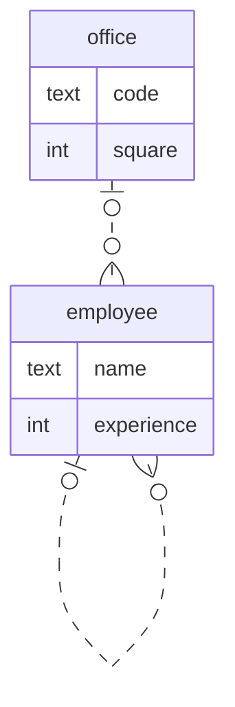

Даны 2 сущности:
- сотрудник со свойствами имя и стаж
- кабинет со свойствами код и площадь

У сотрудника может быть в подчинении много других сотрудников. У сотрудника может быть только один начальник.\
Сотрудник может работать в одном кабинете. В кабинете может работать много сотрудников.

Данным сущностям соответствует следующая диаграмма:


Этой диаграмме в SQL соответствуют следующие таблицы и связи:
```sql
drop table if exists employee cascade;
drop table if exists office cascade;

create table office
(
    id     int generated always as identity primary key,
    code   text,
    square int
);

create table employee
(
    id         int generated always as identity primary key,
    name       text,
    experience int,
    office_id  int references office,
    chief_id   int references employee -- ссылаемся на эту же таблицу
);
```

Пример вывода _всех_ сотрудников с их офисами и подчинёнными (если они есть):
```sql
insert into office (code, square)
values ('303', 50),
       ('308', 30);

insert into employee (name, experience, office_id, chief_id)
values ('Екатерина Ивановна', 20, 1, null),
       ('Альберт Андреевич', 5, 2, 1),
       ('Вячеслав Александрович', 13, 2, 1),
       ('Иван Вячеславович', 5, 2, 2),
       ('Алексей Андреевич', 10, 2, 3),
       ('Пётр Петрович', 5, 2, 4),
       ('Иван Иванович', 5, 2, 4),
       ('Роман Романович', 5, 2, 7);

select employee.id         as employee_id,
       employee.name       as employee_name,
       employee.experience as employee_experience,
       code                as office_code,
       square              as office_square,
       subordinate.name    as subordinate_name
from employee
         join office on employee.office_id = office.id
         left join employee as subordinate on employee.id = subordinate.chief_id;
```
